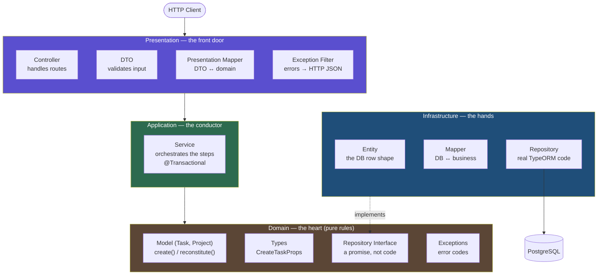
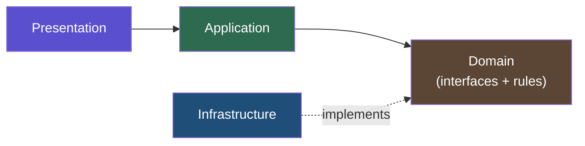
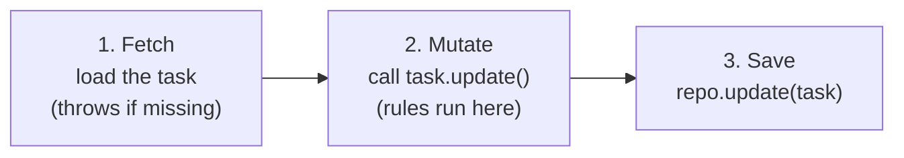
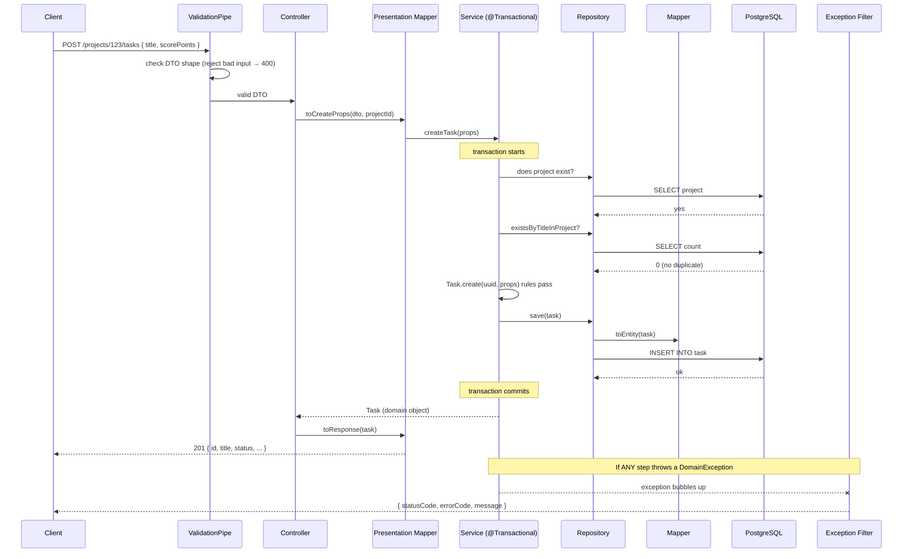

# How I Built a Clean, Domain-Driven Backend (NestJS + TypeORM + PostgreSQL)

> A beginner-friendly walk through Clean Architecture and Domain-Driven Design (DDD), using a real project: **Task Engine** — a small app to manage projects and tasks.
>
> I wrote this for my portfolio. The goal is simple: explain _why_ the code is shaped this way, in plain words, with pictures, and with small pieces of the real code.

---

## What you will learn

By the end of this post you will understand:

- What "Clean Architecture" and "DDD" actually mean (without the scary words).
- The **4 layers** of the app and the **one job** each layer has.
- The **one rule** that keeps everything tidy.
- How a single HTTP request travels through the whole system.
- _Why_ each design choice was made — the part interviewers love to ask about.

If you only remember one sentence, remember this:

> **Every layer has one job. Layers only talk to the layer below them. The core business code knows nothing about the database, the web, or any framework.**

---

## 1. The big idea in one picture

Here is the whole app at a glance. Read it from top to bottom. The arrows show who is allowed to talk to whom — and they only ever point **inward** (toward the center, the Domain).



**In plain words:** A request comes in through the **Presentation** layer (the waiter). It hands the work to the **Application** layer (the head chef), which uses the **Domain** layer (the recipe and the rules). When something needs to be saved or loaded, the **Infrastructure** layer (the kitchen staff) does it and talks to **PostgreSQL**.

Notice the dotted arrow: Infrastructure _implements_ a promise (interface) that the Domain defines. The Domain never points outward. That is the whole trick.

---

## 2. Two analogies to lock it in

### The restaurant kitchen

| Layer              | Who it is         | What it does                                       | Real file               |
| ------------------ | ----------------- | -------------------------------------------------- | ----------------------- |
| **Domain**         | The recipe card   | Says what a dish _is_ and the rules it must follow | `task.ts`, `project.ts` |
| **Application**    | The head chef     | Decides the order of steps, keeps things correct   | `task.service.ts`       |
| **Infrastructure** | The kitchen staff | Fetches ingredients, stores food in the fridge     | `task.repository.ts`    |
| **Presentation**   | The waiter        | Takes your order, brings your plate                | `task.controller.ts`    |

The waiter never cooks. The recipe never talks to a customer. Each one stays in its lane.

### The three infrastructure words

These three words confuse beginners the most, so here is the easy version:

- **Entity = SHAPE** → what the database row looks like (`task.entity.ts`)
- **Mapper = TRANSLATE** → converts between "database world" and "business world" (`task.mapper.ts`)
- **Repository = FETCH** → saves and loads data using TypeORM (`task.repository.ts`)

---

## 3. The golden rule (never break this)



The rule is called **the dependency rule**:

> Arrows only point **inward**. The Domain in the center depends on **nobody**.

Why does this matter? Because the Domain holds your most important code — the business rules. If the Domain doesn't know about the database or NestJS, then:

- You can swap PostgreSQL for MongoDB and the Domain doesn't change.
- You can test the rules without a database or a web server.
- A change in the web layer can never break a business rule by accident.

The Domain has **zero** imports from NestJS and **zero** imports from TypeORM. It is plain TypeScript.

---

## 4. Layer by layer (the deep dive)

Now let's open each layer and see the real code. I'll keep snippets short — the full code is in the repo.

---

### 4.1 Domain layer — the heart

This is where the business rules live. No framework, no database. Just pure TypeScript that answers the question: _"What is a Task, and what rules must always be true?"_

Think of the Domain as the **rulebook of a board game**. The rulebook doesn't care what the box looks like, where you bought it, or whether you play on a table or on the floor. It only says what is _allowed_ and what is _not_. In the same way, the Domain doesn't care about HTTP, JSON, SQL, or NestJS. It only protects the truth of your business.

A Domain folder for one feature (like `task`) usually has **four small parts**:

| Part                     | Folder        | Its one job                                  |
| ------------------------ | ------------- | -------------------------------------------- |
| **Model**                | `model/`      | What a Task _is_ + its behavior and rules    |
| **Types**                | `type/`       | The shape of the data callers send in        |
| **Repository interface** | `repository/` | A _promise_ of how data will be saved/loaded |
| **Exceptions**           | `exception/`  | The named ways things can go wrong           |

Let's look at each one.

#### The model: a private constructor + two factories

The most important file is the `Task` model. It uses a **private constructor**, which means **nobody can write `new Task()` from outside**. Instead, you must go through one of two doors:

- `Task.create(...)` → for a **brand new** task. It checks the rules and fills in defaults.
- `Task.reconstitute(...)` → for a task being **loaded from the database**. The data was already valid when we saved it, so we trust it and skip the checks.

```typescript
export class Task {
  // ... fields like id, title, status, scorePoints ...

  // private = nobody can do "new Task()" from outside
  private constructor(props: { /* all fields */ }) {
    this.id = props.id;
    this.title = props.title;
    // ...assign the rest
  }

  // Door 1: a NEW task — validate + set defaults
  static create(id: string, props: CreateTaskProps): Task {
    if (props.scorePoints < 1 || props.scorePoints > 1000) {
      throw new InvalidScorePointsException(props.scorePoints);
    }
    const now = new Date();
    return new Task({
      id,
      title: props.title,
      status: props.status ?? TaskStatus.TODO, // default
      scorePoints: props.scorePoints,
      completedAt: null,
      createdAt: now,
      updatedAt: now,
      // ...the rest
    });
  }

  // Door 2: a task coming back FROM the database — trust it, no checks
  static reconstitute(props: { /* all fields */ }): Task {
    return new Task(props);
  }
}
```

Why two doors instead of one? Imagine a security guard at a building. A **new visitor** (`create`) must show ID and sign in — that's the validation. But an **employee who already badged in this morning** (`reconstitute`) just walks through — they were already checked. Re-checking data that came from your own database is wasted work, and worse: if a validation rule changes later, old-but-valid rows might suddenly fail to load. So we only validate at the _front door_ (`create`), never on the way back from the DB.

The model also holds **behavior**, not just data. This is the big idea of DDD: the object that _owns_ the data also owns the rules about changing it. A "task" is not a dumb bag of fields — it knows how to complete itself, and it refuses to do something illegal. For example, completing a task protects its own rule ("you cannot complete a task twice"):

```typescript
complete(): void {
 if (this.status === TaskStatus.DONE) {
 throw new Error('Task is already completed');
 }
 this.status = TaskStatus.DONE;
 this.completedAt = new Date();
 this.updatedAt = new Date();
}
```

Notice you cannot just write `task.status = 'done'` from outside and forget to set `completedAt`. The only way to complete a task is to call `complete()`, and that method always does the _full_ correct change. This is how the model stops bugs before they happen.

> **Why a private constructor?** Because it makes it _impossible_ to create an invalid Task. If the constructor were public, anyone could do `new Task({ scorePoints: -50 })` and skip every rule. By hiding it, the only ways in are `create()` (which validates) and `reconstitute()` (trusted DB data). There is no back door, so an invalid Task simply cannot exist anywhere in the system.

#### The types: the input contract

The caller only provides _some_ fields. The system generates the rest (like `id`, `createdAt`, `completedAt`). Why not let the caller send the `id` or `createdAt`? Because those are not the caller's job — the system owns them. The type makes this clear: it lists _only_ what the outside world is allowed to provide.

```typescript
export type CreateTaskProps = {
  projectId: string;
  title: string;
  scorePoints: number; // must be 1–1000
  status: TaskStatus; // defaults to TODO
  description?: string;
  dueDate?: Date;
  recurrence?: CreateRecurrenceProps;
};
```

The `?` means "optional". So a caller _must_ send `projectId`, `title`, and `scorePoints`, but `description` and `dueDate` can be left out. This is a **compile-time** contract — TypeScript checks it while you write code. (Later you'll see the DTO, which is the _runtime_ version of the same idea for live HTTP requests.)

#### The repository interface: a promise, not the real code

This is the part that makes Clean Architecture "click". The Domain needs to save and load tasks — but it must **not** know about TypeORM or PostgreSQL (remember the dependency rule). So instead of writing the saving code, the Domain writes a **promise**: a list of methods that _someone_ will provide later. It's like a job description posted on a wall — "Wanted: someone who can save a task and find a task by id." The Domain doesn't care _who_ applies, as long as they can do the job.

```typescript
export const TASK_REPOSITORY = Symbol('TaskRepository');

export interface ITaskRepository {
  save(task: Task): Promise<void>;
  findById(id: string): Promise<Task | null>;
  findAllByProjectId(projectId: string): Promise<Task[]>;
  existsByTitleInProject(title: string, projectId: string): Promise<boolean>;
  update(task: Task): Promise<void>;
  findAllRecurring(): Promise<Task[]>;
}
```

The `findById` method returns `Task | null` — meaning "a Task, _or_ nothing". That little `| null` is a deliberate choice we'll explain in the Infrastructure section. And note: the interface speaks in **Task** (the business object), never in `TaskEntity` (the database row). The Domain doesn't even know `TaskEntity` exists.

> **Why a `Symbol`?** In TypeScript, interfaces disappear when the code compiles to JavaScript — so at runtime, NestJS can't say "give me an `ITaskRepository`", because that type no longer exists. We need a real value to use as a key. A `Symbol('TaskRepository')` is a unique value that exists at runtime, so NestJS can match "whoever asked for this token" with "the class that provides it". Using a Symbol (instead of a plain string like `'TASK_REPO'`) guarantees no two tokens ever clash, even by accident.

#### Exceptions: errors with codes, not random strings

When something goes wrong in the Domain, we don't throw a plain `Error('not found')`. We throw a **named exception with a code**. Why? Because a code is something the rest of the system can _act on_. Later, the web layer reads the code to decide the right HTTP status (404? 409? 400?) — without having to read the human message and guess.

Every business error extends one base class so they all share the same shape (`errorCode` + `message`):

```typescript
export abstract class DomainException extends Error {
  constructor(
    public readonly errorCode: string,
    public readonly message: string,
  ) {
    super(message);
    this.name = this.constructor.name;
  }
}

export class DuplicateTaskTitleException extends DomainException {
  constructor(title: string) {
    super(
      'DUPLICATE_TASK_TITLE',
      `A task with the title "${title}" already exists in this project`,
    );
  }
}
```

The exception even writes its own friendly message, so the caller never has to. When the service throws `new DuplicateTaskTitleException('Buy milk')`, that's all it needs to do — the code (`DUPLICATE_TASK_TITLE`) and the message come for free, and the web layer turns it into a `409 Conflict` automatically.

**Domain layer in one line:** pure TypeScript that knows the business truth and depends on nothing.

---

### 4.2 Infrastructure layer — the hands

If the Domain is the brain, Infrastructure is the **hands** — it does the messy, real-world work of talking to the database. This is the **only** place TypeORM and PostgreSQL live. Everything here exists to keep the promise (`ITaskRepository`) that the Domain wrote.

Infrastructure for one feature has three jobs, and remember the three magic words: **Entity = SHAPE, Mapper = TRANSLATE, Repository = FETCH.**

#### Entity = the SHAPE of the database row

An Entity is a class covered in TypeORM decorators (`@Entity`, `@Column`, …). Each decorator tells the database how to build the table and each column. The Entity is **not** your business object — it's a mirror of one row in the `task` table.

```typescript
@Entity('task') // maps to the 'task' table
export class TaskEntity {
  @PrimaryColumn({ type: 'uuid' }) // we generate IDs, not Postgres
  id: string;

  @ManyToOne(() => ProjectEntity, (p) => p.tasks)
  @JoinColumn({ name: 'project_id' }) // foreign key on the task table
  project: ProjectEntity;

  @Column({ name: 'project_id', type: 'uuid' })
  projectId: string;

  @Column({ type: 'enum', enum: TaskStatus, default: TaskStatus.TODO })
  status: TaskStatus; // Postgres ENUM enforces valid values

  @CreateDateColumn({ name: 'created_at' })
  createdAt: Date; // TypeORM fills this on INSERT

  @UpdateDateColumn({ name: 'updated_at' })
  updatedAt: Date; // TypeORM updates this on UPDATE
}
```

A few details worth noticing:

- `@PrimaryColumn` (not `@PrimaryGeneratedColumn`) because **we** make the UUID in code, not Postgres. This lets the Domain object have its `id` _before_ it's ever saved.
- There are two project fields: `project` (the full related object, loaded only when we ask) and `projectId` (just the raw id, always there and cheap to read). Most of the time we only need the id.
- `@CreateDateColumn` and `@UpdateDateColumn` are filled in **automatically** by TypeORM, so we never set timestamps by hand at the database level.

#### Mapper = the TRANSLATOR

Here's a problem: the database speaks in `TaskEntity` (flat row, TypeORM decorators), and the business code speaks in `Task` (private constructor, methods, rules). They are two different languages. The **Mapper** is the translator that sits in the middle. Without it, TypeORM decorators would leak into your Domain, or your business rules would leak into your database code — and the two worlds would be glued together forever.

The mapper has two simple directions: load (`toDomain`) and save (`toEntity`).

```typescript
export class TaskMapper {
  // DB row → business object (use reconstitute, no validation)
  static toDomain(entity: TaskEntity): Task {
    return Task.reconstitute({
      id: entity.id,
      title: entity.title,
      status: entity.status,
      scorePoints: entity.scorePoints,
      // ...copy the rest
    });
  }

  // Business object → plain DB row for TypeORM
  static toEntity(domain: Task): TaskEntity {
    const entity = new TaskEntity();
    entity.id = domain.id;
    entity.title = domain.title;
    entity.status = domain.status;
    // ...copy the rest
    return entity;
  }
}
```

See how `toDomain` calls `Task.reconstitute` (the trusted door — no re-validation), while `toEntity` builds a plain object and lets TypeORM handle the timestamps. The mapper is boring on purpose. Boring code is safe code.

#### Repository = the FETCHER (keeps the promise)

The Repository is the class that finally _keeps_ the promise. Notice the very first line: `implements ITaskRepository`. That word `implements` is the contract being signed — TypeScript will now force this class to provide every method the interface listed. If you forget one, the code won't compile.

Inside, it uses TypeORM to actually hit the database, and it **always** runs the result through the mapper before handing it back, so the outside world only ever receives `Task` objects, never raw entities.

```typescript
@Injectable()
export class TaskRepository implements ITaskRepository {
  constructor(
    @InjectRepository(TaskEntity)
    private readonly repo: Repository<TaskEntity>,
  ) {}

  async findById(id: string): Promise<Task | null> {
    const entity = await this.repo.findOne({ where: { id } });
    if (!entity) return null; // returns null, never throws
    return TaskMapper.toDomain(entity); // always translate before returning
  }

  async existsByTitleInProject(title: string, projectId: string) {
    const count = await this.repo
      .createQueryBuilder('task')
      .where('LOWER(task.title) = LOWER(:title)', { title })
      .andWhere('task.project_id = :projectId', { projectId })
      .getCount();
    return count > 0;
  }
}
```

Also notice `existsByTitleInProject` uses `LOWER(...)` on both sides. That makes the check **case-insensitive**, so "Buy Milk" and "buy milk" count as the same title. And it uses `getCount()` instead of loading the whole row — because we only need a yes/no answer, not the data. Small choices like this keep things fast.

#### Wiring the promise to the real code

We have a promise (`ITaskRepository`) and a class that keeps it (`TaskRepository`). But how does the rest of the app get connected to the real class without _importing_ it (which would break the dependency rule)? Through NestJS's dependency injection, in one small piece of config:

```typescript
providers: [
 { provide: TASK_REPOSITORY, useClass: TaskRepository },
 { provide: PROJECT_REPOSITORY, useClass: ProjectRepository },
],
```

Read it as: _"Whenever someone asks for the `TASK_REPOSITORY` token, hand them a `TaskRepository` instance."_ The service asks for the **token** (the promise), and NestJS quietly supplies the **real class** (the implementation). This is the **Dependency Inversion Principle** in action: high-level code depends on an abstraction, and the concrete detail is plugged in from the outside.

The payoff is huge: to switch from PostgreSQL to MongoDB, you write a `MongoTaskRepository` and change `useClass: TaskRepository` to `useClass: MongoTaskRepository`. **One line.** The Domain, the service, and the controller don't change at all, because none of them ever knew which database they were using.

> **Why return `null` instead of throwing?** The repository only knows how to fetch. It does not know what "not found" _means_ for a use case. Sometimes null means "throw a 404" (when you asked for a task by id), and sometimes null/zero means "great, no duplicate exists" (when you're checking before creating). If the repo threw an error every time, the second case would be impossible. So it stays neutral — returns `null` — and lets the service decide what the absence means. This keeps the repo reusable across many use cases.

**Infrastructure layer in one line:** the only place that knows about the database, hidden behind a promise the Domain owns.

---

### 4.3 Application layer — the conductor

If the Domain is the rulebook and Infrastructure is the hands, the Application layer (the **service**) is the **conductor of an orchestra**. The conductor doesn't play any instrument — but they decide the _order_: first the project check, then the duplicate check, then create, then save. The service holds no business rules of its own; it _coordinates_ the Domain and the repository to get a real-world job done. This job is often called a **use case**.

The service has **three jobs**:

1. **Check rules that need the database** (e.g. "is this title already taken?" — the model can't do this, it has no database).
2. **Create or change** domain objects through their factories and methods.
3. **Save** the result through the repository interface.

The most important pattern here is **fetch → mutate → save**:



```typescript
@Transactional()
async createTask(props: CreateTaskProps): Promise<Task> {
 // 1. project must exist
 const project = await this.projectRepo.findById(props.projectId);
 if (!project) throw new ProjectNotFoundException(props.projectId);

 // 2. no duplicate title in this project (needs a DB query!)
 const taken = await this.taskRepo.existsByTitleInProject(
 props.title, props.projectId,
 );
 if (taken) throw new DuplicateTaskTitleException(props.title);

 // 3. build the domain object (validation runs inside create())
 const id = uuidv4(); // we make the ID here, not Postgres
 const task = Task.create(id, props);

 // 4. save it
 await this.taskRepo.save(task);
 return task;
}
```

Look at the order of the steps. We check the cheap, important things _first_ (does the project exist? is the title free?) and only build and save the task once we're sure it's allowed. Also notice the service speaks only in promises and domain objects — `this.taskRepo` is the **interface**, and `Task.create` is the **factory**. It never imports TypeORM or a controller. It sits cleanly in the middle.

**Why generate the UUID here** (`uuidv4()`) instead of letting Postgres do it? Because the Domain object needs its `id` the moment it's created — before it ever reaches the database. Making the id in the application layer means `Task.create(id, props)` always has one, and saving becomes a simple, predictable `INSERT` with no "read it back to find the id" dance.

**`@Transactional()`** wraps the whole method in a single database transaction. Think of it as an "all or nothing" box. If the project check, the duplicate check, and the save all succeed → everything is committed together. But if _anything_ inside throws — even at the last step — **all** the database changes are undone automatically. You never end up half-saved (for example, a task row created but a related counter not updated). For this to work, `initializeTransactionalContext()` must run in `main.ts` before the app starts.

> **Where do business rules live — model or service?** This is a favorite interview question. The rule of thumb: rules about a **single object on its own** live in the **model** (score must be 1–1000, you can't complete a task twice). Rules that need to **look at the rest of the database** live in the **service** (no duplicate title in a project — you can't know that without a query). The model has no repository, so by design it _can't_ check duplicates. That's not a limitation; it's the boundary working correctly.

**Application layer in one line:** the conductor that orders the steps and owns transactions, holding no rules of its own.

---

### 4.4 Presentation layer — the front door

This layer talks HTTP. It validates input, calls the service, and shapes the response. It contains **zero** business logic.

This layer is the **waiter** in our restaurant. It greets the request, writes down the order in a form the kitchen understands, carries it in, and brings the finished plate back out. It never cooks. The moment you see an `if/else` business decision in a controller, something has leaked into the wrong layer.

Presentation has four small pieces: the **DTO** (validate input), the **mapper** (translate to/from the Domain), the **controller** (routing), and the **exception filter** (turn errors into HTTP).

#### DTO = validate the incoming HTTP data

A DTO ("Data Transfer Object") describes the exact shape of an incoming HTTP request and uses `class-validator` decorators to check it _at runtime_ — the moment the request arrives, before any business code runs. If the data is wrong, NestJS rejects it with a `400` automatically and your service is never even called.

```typescript
export class CreateTaskDto {
  @IsString()
  title: string;

  @IsInt()
  @Min(1, { message: 'scorePoints must be at least 1' })
  @Max(1000, { message: 'scorePoints must be at most 1000' })
  scorePoints: number;

  @IsOptional()
  @IsEnum(TaskStatus)
  status?: TaskStatus;
}
```

You might ask: _didn't we already define `CreateTaskProps` in the Domain? Why a separate DTO?_ Because they serve different worlds. `CreateTaskProps` is a **compile-time** type with no runtime checking — perfect for code-to-code calls. The DTO is a **runtime** guard for untrusted input coming over the wire. The DTO also belongs to the web layer (it can carry web-only concerns like date strings), while the Domain type stays clean.

#### Presentation mapper = translate both ways

Just like Infrastructure has a mapper between the database and the Domain, Presentation has a mapper between **HTTP and the Domain**. It works in two directions:

```typescript
// incoming: HTTP DTO → domain input
static toCreateProps(dto: CreateTaskDto, projectId: string): CreateTaskProps

// outgoing: domain object → HTTP response
static toResponse(task: Task): TaskResponseDto
```

Why bother? Because you usually don't want to send your raw Domain object straight to the client — it might hold fields you'd rather hide, or you may want to reshape it for the API. `toResponse` gives you one clear place to decide exactly what the outside world sees. And `toCreateProps` does the small conversions (like turning a date _string_ from JSON into a real `Date`) so the service receives clean, typed data.

#### Controller = just routing, no logic

The controller is thin on purpose. Each method does the same three steps: turn the DTO into domain input, call the service, turn the result into a response. No `if` business logic, no database, no rules. Notice the route is **nested** — `projects/:projectId/tasks` — because tasks belong to a project, and the `projectId` comes from the URL, not the request body. The URL itself expresses the relationship.

```typescript
@Controller('projects/:projectId/tasks')
export class TaskController {
  constructor(private readonly taskService: TaskService) {}

  @Post()
  @HttpCode(HttpStatus.CREATED)
  async create(
    @Param('projectId') projectId: string,
    @Body() dto: CreateTaskDto,
  ): Promise<TaskResponseDto> {
    const props = TaskPresentationMapper.toCreateProps(dto, projectId);
    const task = await this.taskService.createTask(props);
    return TaskPresentationMapper.toResponse(task);
  }
}
```

#### One filter to handle every error

Here's where those error codes from the Domain pay off. Instead of wrapping every controller in `try/catch`, we register **one** global filter. The `@Catch(DomainException)` decorator means it automatically catches the base class **and every subclass** — `TaskNotFoundException`, `DuplicateTaskTitleException`, all of them. It reads the `errorCode`, looks up the matching HTTP status, and sends clean JSON.

```typescript
@Catch(DomainException) // catches every subclass automatically
export class DomainExceptionFilter implements ExceptionFilter {
  catch(exception: DomainException, host: ArgumentsHost): void {
    const response = host.switchToHttp().getResponse<Response>();
    const status = this.getHttpStatus(exception.errorCode);

    response.status(status).json({
      statusCode: status,
      errorCode: exception.errorCode, // e.g. "TASK_NOT_FOUND"
      message: exception.message,
    });
  }

  private getHttpStatus(code: string): number {
    const map: Record<string, number> = {
      TASK_NOT_FOUND: HttpStatus.NOT_FOUND, // 404
      DUPLICATE_TASK_TITLE: HttpStatus.CONFLICT, // 409
      INVALID_SCORE_POINTS: HttpStatus.BAD_REQUEST, // 400
    };
    return map[code] ?? HttpStatus.BAD_REQUEST;
  }
}
```

The result: **zero `try/catch` in your controllers, ever.** A rule throws somewhere deep in the Domain, the exception bubbles all the way up, and this one filter turns it into a proper HTTP response. If you add a new exception tomorrow, you just add one line to the status map.

> **Why validate in BOTH the DTO and the model?** It feels like double work, but they guard different doors. The DTO only runs for HTTP requests. But the model is also called from background jobs, tests, and seed scripts that never touch HTTP — and those paths skip the DTO entirely. So the DTO is the _first_ guard for bad web input (fast, friendly messages), and the model is the _last_ guard for bad data from _anywhere_. Belt and suspenders.

**Presentation layer in one line:** the waiter — validates input, translates, calls the service, shapes the reply, holds no rules.

---

### 4.5 Migrations — version control for your database

A migration is a saved, ordered change to your database structure — like a **git commit, but for your database schema**. Every time you add a table or a column, you write a migration. Run them in order on any machine and you get the exact same database. This is how your laptop, your teammate's laptop, and production all stay in sync.

The golden rule: **`synchronize: false`, always.** Migrations are the _only_ thing allowed to change the schema.

Every migration has two methods: `up()` (do the change) and `down()` (undo it). The `down()` must reverse the `up()` in the **opposite order** — drop the index before the table, drop the table before the enum type it uses — because things depend on each other.

```typescript
public async up(queryRunner: QueryRunner): Promise<void> {
 await queryRunner.query(`CREATE TYPE "task_status_enum" AS ENUM ('todo','in_progress','done')`);
 await queryRunner.query(`
 CREATE TABLE "task" (
 "id" UUID NOT NULL,
 "project_id" UUID NOT NULL,
 "title" VARCHAR(255) NOT NULL,
 "status" "task_status_enum" NOT NULL DEFAULT 'todo',
 "score_points" INTEGER NOT NULL,
 CONSTRAINT "pk_task" PRIMARY KEY ("id"),
 CONSTRAINT "fk_task_project" FOREIGN KEY ("project_id")
 REFERENCES "project" ("id") ON DELETE CASCADE
 )
 `);
 // case-insensitive unique title per project
 await queryRunner.query(`CREATE UNIQUE INDEX "uq_task_title_project" ON "task" (LOWER("title"), "project_id")`);
}

public async down(queryRunner: QueryRunner): Promise<void> {
 await queryRunner.query(`DROP INDEX "uq_task_title_project"`);
 await queryRunner.query(`DROP TABLE "task"`); // table before type
 await queryRunner.query(`DROP TYPE "task_status_enum"`);
}
```

**A note on indexes.** An index makes lookups fast (like the index at the back of a book). This project uses three kinds:

| Type    | Example                                  | Why                                                  |
| ------- | ---------------------------------------- | ---------------------------------------------------- |
| Unique  | `LOWER(title)` per project               | prevents duplicates, case-insensitive                |
| Regular | `project_id`                             | fast "find all tasks in this project"                |
| Partial | `is_recurring WHERE is_recurring = true` | tiny index — only the few recurring rows are indexed |

And there are **three layers of duplicate protection**, so a duplicate title can never slip through — even under a race condition where two requests arrive at the same millisecond:

1. **Service** → the friendly check, gives a nice `DuplicateTaskTitleException` (409).
2. **Unique index** → the database safety net on `LOWER(title)`. If two requests sneak past the service check at once, the database itself rejects the second one.
3. **Foreign key** → stops orphan tasks pointing to a project that doesn't exist.

The service is for a _good user experience_; the database constraints are the _real guarantee_. You want both.

> **Why not `synchronize: true`?** It's tempting because it auto-updates your tables to match your entities. But in production it can silently run `DROP COLUMN` or `ALTER TABLE` the moment an entity changes — and wipe out real customer data with no warning and no undo. Migrations are the grown-up version: explicit, reviewed in a pull request, versioned in git, and reversible with `down()`.

**Migrations in one line:** git commits for your database — explicit, ordered, reversible, never automatic.

---

## 5. Follow one request from start to finish

Let's trace a real request: **`POST /projects/:projectId/tasks`** (create a task). This is the part that makes everything "click".



Now let's walk through that same picture slowly, one stop at a time. Imagine the request as a **package** being passed from hand to hand. At each stop, watch what the package _is_ and how it changes shape.

#### The request that starts it all

```http
POST /projects/8f3.../tasks
Content-Type: application/json

{ "title": "Buy milk", "scorePoints": 50 }
```

#### Stop 1 — ValidationPipe: the bouncer at the door

Before _any_ of our code runs, NestJS's global `ValidationPipe` takes the raw JSON and checks it against `CreateTaskDto`. This is the runtime guard we built earlier.

- Is `title` a string? Is `scorePoints` an integer between 1 and 1000?
- If **no** → the request is rejected right here with a `400 Bad Request`. The controller is never even called, and the database is never touched. Bad input dies at the door.
- If **yes** → the validated DTO is handed to the controller.

_The package right now:_ a trusted `CreateTaskDto`.

#### Stop 2 — Controller: the waiter takes the order

```typescript
@Post()
async create(
 @Param('projectId') projectId: string, // pulled from the URL
 @Body() dto: CreateTaskDto, // the validated body
) {
 const props = TaskPresentationMapper.toCreateProps(dto, projectId);
 const task = await this.taskService.createTask(props);
 return TaskPresentationMapper.toResponse(task);
}
```

The controller grabs two things: `projectId` from the **URL** (not the body — remember the nested route) and the validated DTO from the **body**. It does no thinking of its own; it just hands off.

#### Stop 3 — Presentation Mapper: translate web → business

`toCreateProps(dto, projectId)` turns the web-shaped DTO into a clean Domain input (`CreateTaskProps`). It merges in the `projectId` from the URL and does small conversions (like turning a date _string_ into a real `Date`). Now the data is in the Domain's language.

_The package right now:_ a `CreateTaskProps` object.

#### Stop 4 — Service: the conductor runs the steps

This is where the real work happens, all inside one `@Transactional()` box (all-or-nothing):

```typescript
@Transactional()
async createTask(props: CreateTaskProps): Promise<Task> {
 // 4a. Does the project exist? (DB query through the interface)
 const project = await this.projectRepo.findById(props.projectId);
 if (!project) throw new ProjectNotFoundException(props.projectId);

 // 4b. Is the title already taken in this project? (DB query)
 const taken = await this.taskRepo.existsByTitleInProject(props.title, props.projectId);
 if (taken) throw new DuplicateTaskTitleException(props.title);

 // 4c. Build the Task — business rules run inside create()
 const id = uuidv4();
 const task = Task.create(id, props); // score 1–1000 checked here

 // 4d. Save it
 await this.taskRepo.save(task);
 return task;
}
```

Notice the order: cheap, important checks **first** (project exists → title free), then build, then save. If any check fails, we throw _before_ writing anything. And the service speaks only in promises (`this.taskRepo`) and the factory (`Task.create`) — it never imports TypeORM.

#### Stop 5 — Repository + Mapper: business → database

`taskRepo.save(task)` lands in the real `TaskRepository`. It uses `TaskMapper.toEntity(task)` to turn the `Task` (business object) into a `TaskEntity` (database row), then TypeORM runs the actual `INSERT INTO task ...`.

_The package right now:_ a row in PostgreSQL.

#### Stop 6 — the transaction commits

The `INSERT` succeeded and nothing threw, so `@Transactional()` **commits** — the changes are now permanent. (If anything had failed, every change inside the box would have been rolled back together.)

#### Stop 7 — the journey back out

The service returns the `Task` domain object to the controller. The controller calls `TaskPresentationMapper.toResponse(task)` to shape it into a `TaskResponseDto`, and NestJS serializes that to JSON:

```http
201 Created
{ "id": "9c1...", "title": "Buy milk", "status": "todo", "scorePoints": 50, ... }
```

Done! The package started as raw JSON, became a DTO, then domain props, then a Task, then a DB row — and came back as a clean response. Each layer only ever spoke its own language, and the translation happened at the borders.

#### The other path: when something goes wrong

Now suppose at **Stop 4b** the title "Buy milk" already exists. The service throws `new DuplicateTaskTitleException('Buy milk')`. Here's the beautiful part — **nobody catches it along the way**. There is no `try/catch` in the service or controller. The exception simply bubbles all the way up until the global **Exception Filter** catches it:

```typescript
@Catch(DomainException)
export class DomainExceptionFilter implements ExceptionFilter {
  catch(exception: DomainException, host: ArgumentsHost): void {
    const response = host.switchToHttp().getResponse<Response>();
    const status = this.getHttpStatus(exception.errorCode); // DUPLICATE_TASK_TITLE → 409
    response.status(status).json({
      statusCode: status,
      errorCode: exception.errorCode,
      message: exception.message,
    });
  }
}
```

Two things happen automatically:

1. The `@Transactional()` box sees an error escaped, so it **rolls back** — no half-written data.
2. The filter reads the `errorCode`, maps it to the right HTTP status, and returns clean JSON:

```http
409 Conflict
{ "statusCode": 409, "errorCode": "DUPLICATE_TASK_TITLE",
 "message": "A task with the title \"Buy milk\" already exists in this project" }
```

This is why the layers stay so clean: **the happy path and the error path are completely separate.** Your business code just throws meaningful exceptions and trusts the filter to turn them into correct HTTP responses.

#### One-glance summary of the whole trip

| Stop                   | Layer          | The package is now…                     |
| ---------------------- | -------------- | --------------------------------------- |
| 1. ValidationPipe      | Presentation   | raw JSON → validated `CreateTaskDto`    |
| 2. Controller          | Presentation   | DTO + `projectId` from URL              |
| 3. Presentation Mapper | Presentation   | `CreateTaskProps` (domain input)        |
| 4. Service             | Application    | checks rules, builds a `Task`           |
| 5. Repository + Mapper | Infrastructure | `TaskEntity` → SQL `INSERT`             |
| 6. Commit              | Infrastructure | a permanent row in PostgreSQL           |
| 7. Response Mapper     | Presentation   | `Task` → `TaskResponseDto` → `201` JSON |

---

## 6. The "why" behind each choice (interview-ready)

| Question                           | Short, simple answer                                                                                    |
| ---------------------------------- | ------------------------------------------------------------------------------------------------------- |
| What is Clean Architecture?        | Dependencies point inward. The Domain in the center knows nothing about anyone.                         |
| What is DDD?                       | Build your code around real business ideas (Task, Project), not around database tables.                 |
| Why a private constructor?         | So you can never make an invalid object. The only doors are `create()` and `reconstitute()`.            |
| `create()` vs `reconstitute()`?    | `create()` is for new objects (validates + defaults). `reconstitute()` is for trusted data from the DB. |
| Why interfaces for repositories?   | So business code depends on a promise, not on TypeORM. You can swap the database freely.                |
| What is the Symbol token for?      | A unique key for dependency injection, so names never clash.                                            |
| What does `@Transactional` do?     | Wraps the method in a DB transaction — any failure rolls everything back.                               |
| Why a Mapper?                      | To keep the database shape and the business shape separate, so each can change alone.                   |
| Why return `null` from the repo?   | The repo just fetches; the service decides what "not found" means. Keeps the repo reusable.             |
| Where do duplicate checks go?      | In the service — they need a DB query the model can't make.                                             |
| Why migrations, not `synchronize`? | Explicit, reviewed, versioned, reversible. `synchronize` can silently delete data.                      |
| Why one exception filter?          | So controllers never need `try/catch`. Domain errors become HTTP JSON in one place.                     |
| Why nested routes?                 | The URL shows the relationship: tasks belong to projects. `projectId` comes from the URL.               |

---

## 7. Code recap (all the key pieces in one place)

For quick copy/skim, here are the core snippets grouped by layer.

**Domain — model (private constructor + factories):**

```typescript
export class Task {
  private constructor(props) {
    /* assign fields */
  }

  static create(id, props) {
    // NEW: validate + defaults
    if (props.scorePoints < 1 || props.scorePoints > 1000)
      throw new InvalidScorePointsException(props.scorePoints);
    return new Task({ id, status: props.status ?? TaskStatus.TODO /* ... */ });
  }

  static reconstitute(props) {
    // FROM DB: trusted, no checks
    return new Task(props);
  }

  complete() {
    // behavior + rule
    if (this.status === TaskStatus.DONE) throw new Error('Already completed');
    this.status = TaskStatus.DONE;
    this.completedAt = new Date();
  }
}
```

**Domain — repository interface + token:**

```typescript
export const TASK_REPOSITORY = Symbol('TaskRepository');
export interface ITaskRepository {
  save(task: Task): Promise<void>;
  findById(id: string): Promise<Task | null>;
  existsByTitleInProject(title: string, projectId: string): Promise<boolean>;
  update(task: Task): Promise<void>;
}
```

**Infrastructure — entity, mapper, repository:**

```typescript
@Entity('task')
export class TaskEntity {
  @PrimaryColumn({ type: 'uuid' }) id: string;
  @Column({ type: 'enum', enum: TaskStatus }) status: TaskStatus;
  @CreateDateColumn({ name: 'created_at' }) createdAt: Date;
}

export class TaskMapper {
  static toDomain(e: TaskEntity): Task {
    return Task.reconstitute({ ...e });
  }
  static toEntity(d: Task): TaskEntity {
    const e = new TaskEntity();
    e.id = d.id;
    /* ... */ return e;
  }
}

@Injectable()
export class TaskRepository implements ITaskRepository {
  async findById(id: string) {
    const e = await this.repo.findOne({ where: { id } });
    return e ? TaskMapper.toDomain(e) : null;
  }
}
```

**Infrastructure — wiring the token:**

```typescript
providers: [{ provide: TASK_REPOSITORY, useClass: TaskRepository }];
```

**Application — service (fetch → mutate → save + transaction):**

```typescript
@Transactional()
async updateTask(id: string, props: UpdateTaskProps): Promise<Task> {
 const task = await this.getTaskById(id); // fetch (throws if missing)
 task.update(props); // mutate (rules run)
 await this.taskRepo.update(task); // save
 return task;
}
```

**Presentation — controller, DTO, filter:**

```typescript
@Controller('projects/:projectId/tasks')
export class TaskController {
  @Post()
  async create(
    @Param('projectId') projectId: string,
    @Body() dto: CreateTaskDto,
  ) {
    const props = TaskPresentationMapper.toCreateProps(dto, projectId);
    const task = await this.taskService.createTask(props);
    return TaskPresentationMapper.toResponse(task);
  }
}

export class CreateTaskDto {
  @IsString() title: string;
  @IsInt() @Min(1) @Max(1000) scorePoints: number;
}

@Catch(DomainException)
export class DomainExceptionFilter implements ExceptionFilter {
  catch(ex: DomainException, host: ArgumentsHost) {
    const res = host.switchToHttp().getResponse();
    res.status(this.getHttpStatus(ex.errorCode)).json({
      errorCode: ex.errorCode,
      message: ex.message,
    });
  }
}
```

**Database — migration (`up` / `down`):**

```typescript
public async up(qr: QueryRunner) {
 await qr.query(`CREATE TABLE "task" ( "id" UUID PRIMARY KEY, ... )`);
 await qr.query(`CREATE UNIQUE INDEX "uq_task_title_project" ON "task" (LOWER("title"), "project_id")`);
}
public async down(qr: QueryRunner) {
 await qr.query(`DROP INDEX "uq_task_title_project"`);
 await qr.query(`DROP TABLE "task"`);
}
```

---

## 8. Wrapping up

Clean Architecture sounds fancy, but it comes down to one habit: **give every piece one job, and make the important code (the Domain) depend on nothing.** Once you do that, the app becomes easy to test, easy to change, and hard to break by accident.

Here's the whole project in numbers — every file has a single, clear responsibility:

```
domain/ 14 files (models, types, interfaces, exceptions)
application/ 3 files (2 services + 1 module)
infrastructure/ 10 files (2 entities, 2 mappers, 2 repos, module, data-source)
presentation/ 11 files (2 controllers, 4 DTOs, 2 mappers, module, filter)
migrations/ 2 files (project table, task table)
config/ 2 files (app.module, main.ts)
─────────────────────────
Total: 42 files
```

If you want the full code, it's all on GitHub: **[github.com/rizonkumar/task-engine](https://github.com/rizonkumar/task-engine)**. Thanks for reading!

> _Built as a learning project with NestJS · TypeORM · PostgreSQL · Clean Architecture · DDD._
